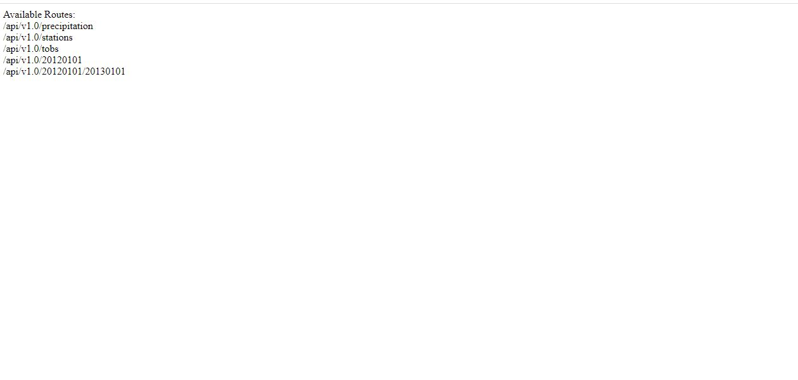
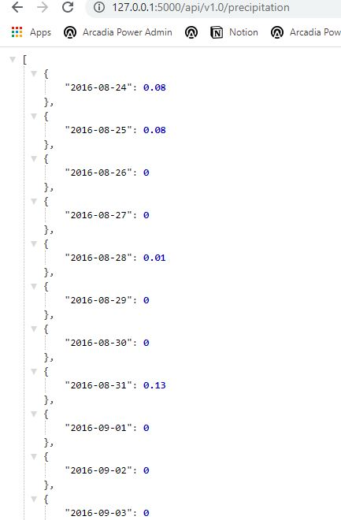
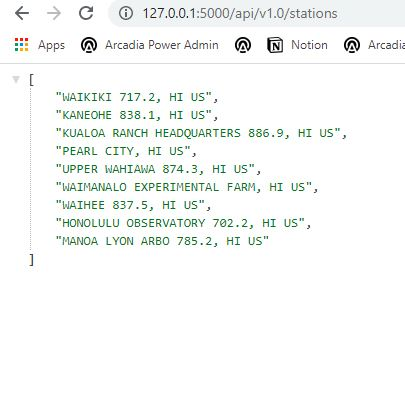
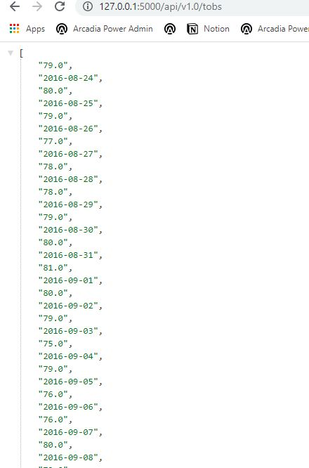
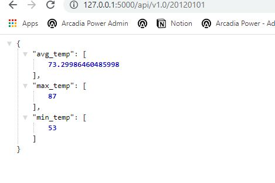
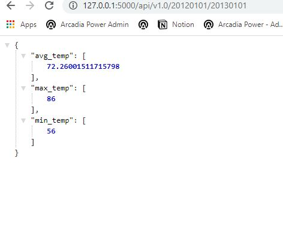

# sqlalchemy-challenge

I decided to do a climate analysis on Honolulu, Hawaii. The following outlines the analyses I completed. 

## How to Run Code

1. Clone repository into a directory on your computer

2. Open repository in code source editor

3. Navigate to "Hawaii Climate App".py and run the code

4. Navigate to the server link in your terminal

5. Copy and paste various routes at the end of the server link

### Precipitation Analysis

* Designed a query to retrieve the last 12 months of precipitation data.

* Selected only the `date` and `prcp` values.

* Loaded the query results into a Pandas DataFrame and set the index to the date column.

* Sorted the DataFrame values by `date`.

* Plotted the results using the DataFrame `plot` method.

* Used Pandas to print the summary statistics for the precipitation data.

### Station Analysis

* Designed a query to calculate the total number of stations.

* Designed a query to find the most active stations.

* Designed a query to retrieve the last 12 months of temperature observation data (tobs).

  * Filtered by the station with the highest number of observations.

  * Plotted the results as a histogram with `bins=12`.

- - -

## Step 2 - Climate App

I also designed a Flask API based on the queries that I just developed.

### Routes

* `/`

  * Home page.

  * Lists all routes that are available.

* `/api/v1.0/precipitation`

  * Converted the query results to a Dictionary using `date` as the key and `prcp` as the value.

  * Returned the JSON representation of my dictionary.

* `/api/v1.0/stations`

  * Returned a JSON list of stations from the dataset.

* `/api/v1.0/tobs`
  * queried for the dates and temperature observations from a year from the last data point.
  * Returned a JSON list of Temperature Observations (tobs) for the previous year.

* `/api/v1.0/<start>` and `/api/v1.0/<start>/<end>`

  * Returned a JSON list of the minimum temperature, the average temperature, and the max temperature for a given start or start-end range.

  * When given the start only, calculated `TMIN`, `TAVG`, and `TMAX` for all dates greater than and equal to the start date.

  * When given the start and the end date, calculated the `TMIN`, `TAVG`, and `TMAX` for dates between the start and end date inclusive.
  
  ## Screenshots
  
  
  
  The home page lists all routes available
  
  
  
  This is a screenshot of the precipitation route which contains the precipitation for various dates in Honolulu. The data was stored as a dictionary in JSON format so that a data analyst or scientist could easily query the data if desired.
  
  
  
  This is a screenshot of the stations route which is a list of all weather stations in Honolulu. The data was stored in a list as that would be the easiest way for a data analyst to manipulate this data.
  
   
   
  This is a screenshot of the tobs route which contains a list of dates and temperature observations. This data could be displayed in a dictionary or a list but chose a list since the tobs and dates are in chronological order.
  
   
   
   This is an image of the 20120101 route which contains the min, max, and average temperature for that particular date. The data was stored as a dictionary in JSON format so that a data analyst or scientist could easily query the data if desired.
   
   
   
  
  This is an image of the 20120101/20130101 route which contains the min, max, and average temperature for that date range. The data was stored as a dictionary in JSON format so that a data analyst or scientist could easily query the data if desired.
   
  
  
  
  
  
  
  
